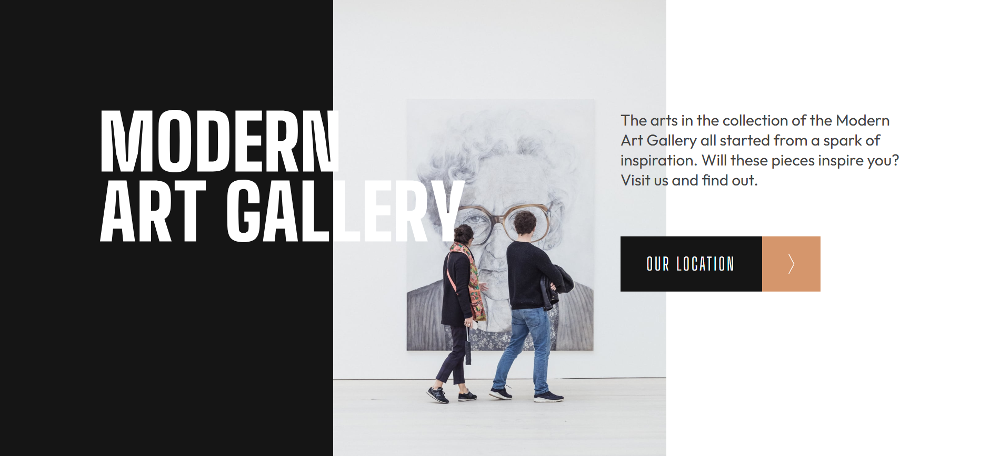
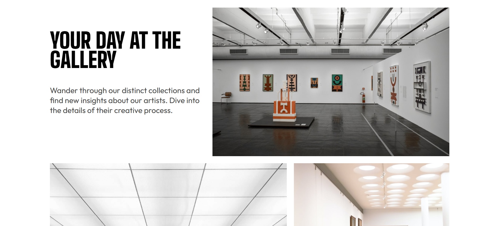
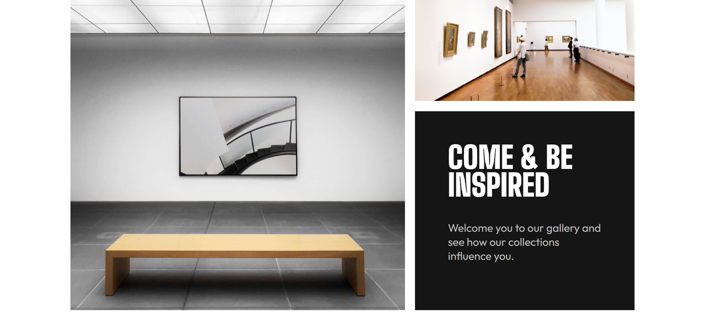
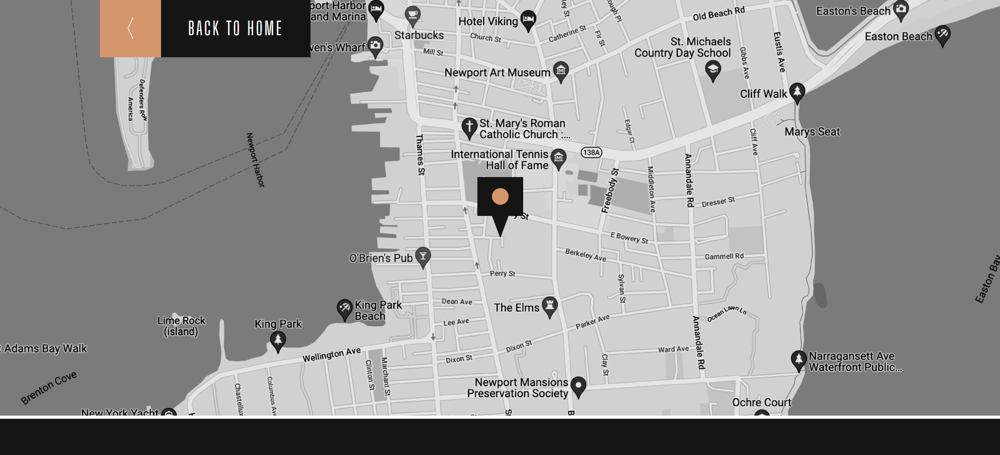
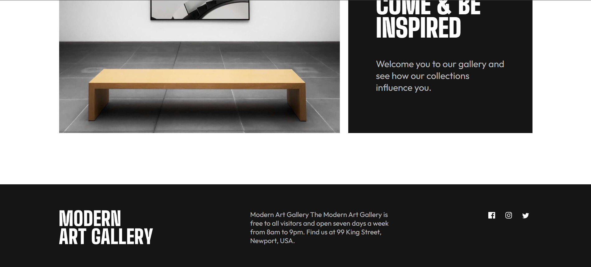

# 🎨 Art Gallery Website

A clean and modern **Art Gallery website** built using **HTML, CSS, and JavaScript**.
Focused on **visual storytelling, typography, and responsive layout design**.

---

## 🚀 Live Demo

👉 https://msadafk.github.io/Art-gallery-website/

---

## 📂 GitHub Repository

👉 https://github.com/MsadafK/Art-gallery-website

---

## 🖼️ Screens Preview

### 🏠 Hero Section



---

### 🖼️ Gallery Sections





---

### 📍 Location Page



---

### 📌 Footer



---

## 📌 Overview

This project is a **modern art gallery landing page** designed to highlight:

* Strong **visual hierarchy**
* Bold **typography**
* Clean **grid-based layout**
* Seamless **navigation between pages**

The goal was to replicate a **real-world design with pixel-perfect accuracy**.

---

## ✨ Features

* 🎯 Pixel-perfect UI
* 📱 Fully responsive (mobile / tablet / desktop)
* 🖼️ Image-driven gallery layout
* 📍 Dedicated location page with map
* 🎨 Clean and minimal design

---

## 🛠️ Tech Stack

* HTML5
* CSS3
* JavaScript (Vanilla)

---

## 📂 Project Structure

```
Art-gallery-website/
├── assets/
│   ├── desktop/
│   ├── tablet/
│   ├── mobile/
│   ├── hero-section.png
│   ├── gallery-section-one.png
│   ├── gallery-section-two.png
│   ├── footer.png
│   ├── map.png
│   └── icons & logos
│
├── index.html
├── location.html
├── style.css
└── styles.css
```

---

## ⚙️ How to Run Locally

```bash
git clone https://github.com/MsadafK/Art-gallery-website.git
cd Art-gallery-website
```

👉 Then simply open `index.html` in your browser.

---

## 📈 What I Learned

* Building responsive layouts **without frameworks**
* Managing **multiple image breakpoints**
* Improving **UI spacing & typography consistency**
* Structuring a clean static project

---

## 🔮 Future Improvements

* Add scroll animations
* Improve accessibility (ARIA, semantics)
* Optimize images for faster loading
* Add interactive elements

---

## 👨‍💻 Author

**Mohd Sadaf**
Frontend Developer

* [](https://github.com/MsadafK)
* [](https://www.linkedin.com/in/mohd-sadaf/)

---

## ⭐ If you like this project

Give it a ⭐ on GitHub — it helps a lot!

---

## 📬 Feedback

If you have suggestions or improvements, feel free to open an issue or connect!
